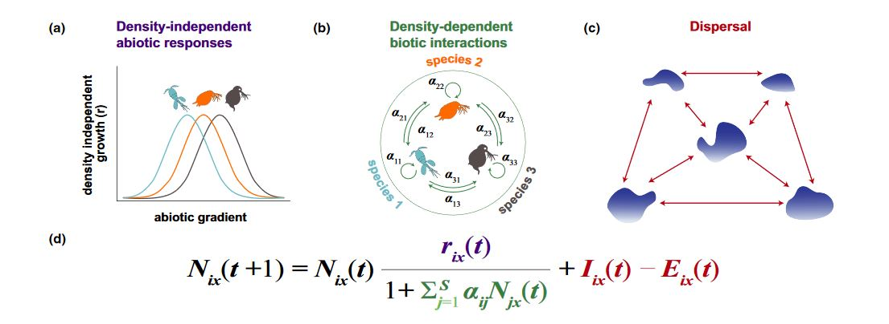

```{r setup, include=FALSE}
knitr::opts_chunk$set(echo = TRUE)
```

## The simulation framework

### Install

Borrow from Thompson et al. (2020) and slightly modified.

To install from GitHub

```{r, eval=F}
devtools::install_github("mxdub/TMDSpatial")
```

### Use

Function is quickly described on GitHub - see Thompson et al. (2020) for details on implementation. The overall idea :



We are going to use only the simulation function : *simulate_MC()*. All parameters can be view in the help (?simulate_MC()). Main parameters are already set for our use here.

The typical use of that function :

```{r, message=F, output = F, results='hide', warning=FALSE}
library(TMDSpatial)
# Some additional packages might be needed:
library(tidyverse)
library(vegan)

n_patch = 100
n_species = 10

sim = simulate_MC(patches = n_patch,     # Number of patch
                  species = n_species,   # Number of species
                  env1Scale = 1,         # Spatial autocorrelation for environmental variable (from 1 to 999)
                  env_niche_breadth = 1, # Species environmental niche breadth (can be a vector)
                  kernel_exp = 0.2)      # Rate of decrease of disp. kernel (e.g. P(disp) = exp(-kernel_exp*dist(i,j)))

```

At the end of simulation. Two plots are displayed - (i) species 'environmental niche', (ii) interaction matrix.

In this case; environmental niche breadth are large (env_niche_breadth = 1), environment is not auto-correlated in space and dispersal is limited.

The dispersal kernel :

```{r}
curve(exp(-0.2*x), xlim = c(0,140)) # Max distance among patch is ca. 140 units
```

You can also plot patches in space, with their environmental value to see how environmental values are clustered in space.

```{r}

plots_envt(sim)

```

In the end, you also have some helper functions to gather some data from the simulation output :

To get environmental values and geographical positions :

```{r}

data_envt = get_envt(sim)
data_geo = get_geoposition(sim)

```

And to get abundances and/or occupancies (i.e. presence/absence)

```{r}

abundances = sim_to_matrix(sim)
occupancies = abund_to_occ(abundances)

```

And lastly, it's possible to plot directly occupancies over time for all species:

```{r}

plots_occupancies(occupancies)

```

## Variation partitioning approach

### (ecological) Distances measures

Several distances measures can be used for ordinations. They vary in how (relatives) abundances are considered, and whether more weight is put on rare or common species. They also condition the ordination method that can be used.

As a rule of thumb:

-   Bray-Curtis distance : If absolute abondances differences are important
-   Hellinger distance : If relative abundances differences are important - and common species important
-   Chi square distance : If relative abundances differences are important - and rare species important

The same distances can be used for binary data (in particular, Bray-Curtis distance is equivalent to Sorensen dissimilarity)

Some ordination methods works on *raw* data (eventually transformed - e.g., Hellinger transformed) (e.g., (constrained) Canonical Analysis, rda), whereas other works on distances (e.g., PCoA, dbRDA).

For the following, we will only use Hellinger and Bray-Curtis distances with associated methods (rda(), and dbrda(), as we will be interested in constrained analysis, and partition of variance).

### (spatial) Predictors

Numerous methods exist to model space predictors, here, we will use PCNM (Principal Coordinates of Neighbourhood Matrix, Borcard & Legendre, 2002). The general idea is to start from the among-patch distance matrix, truncates larges distances (fixed to a constant), and run a PCA on resulting matrix. Only eigenvectors associated with positive eigenvalues are kept.

Pcnms can easily be obtained using {vegan} package :

```{r}

library(vegan)
dist_matrix = dist(data_geo)
pcnms = scores(pcnm(dist_matrix))

```

They represent autocorrelation at various scales... For exemple, the three first vectors :

```{r, fig.height=5, fig.width=15}

dt = tibble(x = data_geo$x, y = data_geo$y, g1 = pcnms[,1], g2 = pcnms[,2], g3 = pcnms[,3]) %>%
  pivot_longer(-c(x,y), names_to = "PCNMs")

ggplot(dt, aes(x=x,y=y,color=value))+
  geom_point(size = 4)+
  facet_grid(.~PCNMs)+
  scale_color_gradient2()+
  theme_bw()

```


### Partionning the variance between environmental and geographical distances

Classic methods works on snapshot data (i.e. a community matrix, without temporal dimension). We are therefor going to select a 'slice' of the dataset (e.g., year 200).

```{r}

# taking time = 200
snapshot = t(abundances[,,200]) # Matrix is transpose (inverts rows / cols)

```

#### Using Hellinger distance

{Vegan} package propose a easy-to-use function to compute a partition of variance (varpart() function)

```{r}

vp = varpart( snapshot,
              ~env1+I(env1^2), # Why using square envt ?
              pcnms,
              data = data_envt, transfo = 'hel')

vp

plot(vp, bg = c("hotpink","skyblue"))

```

Variance explained (adjusted-R2, see Peres-Neto et al. (2006).) by each fractions are presented in the output from varpart(), and displayed in the plot.

In order to go further, and test individual parts, we rely on the associated method (here, rda for Hellinger transform).

##### Testing X1 & X2 fractions :

Is there a significant effect of X1 component (environmental variables) :

```{r}

frac_envt = rda(decostand(snapshot, "hel")~env1+I(env1^2),
                data = data_envt)
frac_envt

# Compare full model to reduced model (i.e. without explicative table)
anova(frac_envt)

# Previous Adjust R2 can be find with : 
RsquareAdj(frac_envt)

  
```

Is there a significant effect of X2 component (spatial variables - spatial autocorr.) :

```{r}

frac_spat = rda(decostand(snapshot, "hel")~.,
                data = as.data.frame(pcnms))
frac_spat

# Compare full model to reduced model (i.e. without explicative table)
anova(frac_spat)

# Previous Adjust R2 can be find with : 
RsquareAdj(frac_spat)

```

##### Are these fraction still significant once accounted for shared effects ? (partial RDA)

Is there a significant effect of X1 component (environmental variables) independently of X2 :

```{r}

frac_envt_indp = rda(decostand(snapshot, "hel")~env1+I(env1^2)+Condition(pcnms),
                data = data_envt)
frac_envt_indp

# Compare full model to reduced model (i.e. without condition table)
anova(frac_envt_indp)

# Previous Adjust R2 can be find with : 
RsquareAdj(frac_envt_indp)

```

Is there a significant effect of X2 component (spatial variables) independently of X1 :

```{r}

frac_spat_indp = rda(decostand(snapshot, "hel")~Condition(env1+I(env1^2))+pcnms,
                data = data_envt)
frac_spat_indp

# Compare full model to reduced model (i.e. without condition table)
anova(frac_spat_indp)

# Previous Adjust R2 can be find with : 
RsquareAdj(frac_spat_indp)

```

##### Variable selection ?

Here, all variables were kept in both table. But, some table have numerous variable (especially with the PCNMs), thus, it might be desirable to select only some of them. Once again, {vegan} propose a convenient function for that purpose :

```{r, output = F, results='hide',}
# Define a null and full model

mod0 = rda(decostand(snapshot, "hel") ~ 1, data = as_tibble(pcnms))
mod1 = rda(decostand(snapshot, "hel") ~ ., data = as_tibble(pcnms))
os = ordistep(mod0, scope = formula(mod1)) # Compare model using AIC - with both forward and backward selection.
                                           # Can take some time...

# We can then get the significant pcnms
pcnms_tokeep = names(os$terminfo$ordered)

# Make a new, reduced, pcnms table
pcnms_reduced = pcnms[,pcnms_tokeep]

print(paste0(round(length(pcnms_tokeep)/dim(pcnms)[2], 2)*100,"% of pcnms are kept"))

```

Compare with the first VP results :

```{r}

vp_selection = varpart( snapshot,
                        ~env1+I(env1^2), 
                        pcnms_reduced,
                        data = data_envt, transfo = 'hel')

vp_selection

plot(vp_selection, bg = c("hotpink","skyblue"))


```

You could also re-run analysis to get new pvalues from this new reduced PCNMs table.

#### Using Bray-Curtis distance

Now, using the Bray-Curtis distance. The varpart() function can be used in the same way, but fractions tests should now be done using dbrda() method (distance-based rda) as Bray-Curtis is a distance contrary to the Hellinger transform. Also, Bray-Curtis cannot deal with data where some patches are empty. Such data have to be filter before running analysis.

```{r}
# Filtering dataset
to_remove = apply(snapshot, 1, sum) == 0
if(sum(to_remove)>0){
  snapshot = snapshot[-to_remove,]
  data_envt = data_envt[-to_remove,]
  data_geo = data_geo[-to_remove,]
}
```

VarPart analysis

```{r}
dist_matrix = dist(data_geo)
pcnms = scores(pcnm(dist_matrix))

vp = varpart(vegdist(snapshot, method = "bray"),
              ~env1+I(env1^2),
              pcnms,
              data = data_envt)
vp

plot(vp, bg = c("hotpink","skyblue"))


```

Testing of partition is then made using dbrda() functions :

```{r}

frac_envt = dbrda(snapshot ~ env1+I(env1^2),data = data_envt, dist = 'bray')
frac_envt
RsquareAdj(frac_envt)
anova(frac_envt)

# etc. for [x2], [x2|x1], [x1|x2] ...
```

### Practical (for true)

Variation partitioning often used to tease appart effects of environmental variables (as a proxy of niche-based mechanisms) against spatial predictors (as a proxy of dispersal - \~ neutral-based processes).

Using the simulation function above, it's possible to simulate either fully niche based communities and/or communities constrained by dispersal, while considering spatial autocorrelation for environmental gradient.

-   Niche component : small vs. large 'envt_niche_breadth' (e.g., 0.1 vs . 1)
-   Dispersal component : slow vs. quick decrease rate of disp. kernel 'kernel_exp' (0.01 vs. 0.2)
-   Environmental auto-correlation : no correlation vs. fully auto correlated 'env1Scale' (from 1 to 999)

Can try by yourself !

Can also check :

-   How adjR2 values & pval change with variable selection ?

-   Is there differences between presence/absence based vs. abundance-based approaches ?

-   What if another time is used ? (e.g., taken at the beginning of the time serie ?)

-   What if initial distribution of each species is spatially clustered (i.e., mimicking an invasion situation)

    -   Set the 'local_start' argument to TRUE
    -   Compare ordination results for very first time steps vs. long-term dyn. equilibrium - e.g., in a case without disp. limitation ?

```{r, results='hide' }
sim = simulate_MC(patches = n_patch,       # Number of patch
                  species = n_species,     # Number of species
                  env1Scale = 1,           # Spatial autocorrelation for environmental variable (from 1 to 999)
                  env_niche_breadth = 0.1, # Niche effects
                  kernel_exp = 0.001,       # Dispersal not limited by distance
                  local_start = T)

data_envt = get_envt(sim)
data_geo = get_geoposition(sim)

pcnms = scores(pcnm(dist(data_geo)))

abundances = sim_to_matrix(sim)
occupancies = abund_to_occ(abundances)

plots_occupancies(occupancies)

```

Keep a simulation with enough species at equilibrium to be meaningful, and compare e.g., steps 5 vs. steps 250... Can restart several times.

```{r, echo = F, results = 'hide'}
snapshot_short = t(abundances[,,5]) # Matrix is transpose (inverts rows / cols)
snapshot_long = t(abundances[,,250]) # Matrix is transpose (inverts rows / cols)

vp = varpart( snapshot_short,
              ~env1+I(env1^2), # Why using square envt ?
              pcnms,
              data = data_envt, transfo = 'hel')

vp


vp = varpart( snapshot_long,
              ~env1+I(env1^2), # Why using square envt ?
              pcnms,
              data = data_envt, transfo = 'hel')

vp

```

-   Tricky one : Which processes are important for this dataset (can be loaded directly with read_rds()) ?

```{r, eval = F, echo = F, message=F, output = F, results='hide', warning=FALSE}
sim = simulate_MC(patches = n_patch,       # Number of patch
                  species = n_species,     # Number of species
                  env1Scale = 850,           # Spatial autocorrelation for environmental variable (from 1 to 999)
                  env_niche_breadth = 0.1, # Niche effects
                  kernel_exp = 0.01)

data_envt = get_envt(sim)

# Cheat
data_envt_dummy = tibble(env1 = env_generate(sim$landscape, env1Scale = 1, timesteps = 1)$env1)

data_geo = get_geoposition(sim)

pcnms = scores(pcnm(dist(data_geo)))

abundances = sim_to_matrix(sim)
occupancies = abund_to_occ(abundances)

plots_occupancies(occupancies)

snapshot = t(abundances[,,200]) # Matrix is transpose (inverts rows / cols)

# saveRDS(snapshot, file = "./data/vp_snap.rds")
# saveRDS(pcnms, file = "./data/vp_pcnms.rds")
# saveRDS(data_envt_dummy, file = "./data/vp_envt.rds")
# saveRDS(data_envt, file = "./data/vp_envt2.rds")

```

```{r}

snapshot = read_rds("./data/vp_snap.rds")
pcnms = read_rds('./data/vp_pcnms.rds')
data_envt = read_rds('./data/vp_envt.rds')

```

If we now say, there is in fact, no dispersal limitation ? What could explained such results ?

```{r, eval = F, echo = F}
vp = varpart( snapshot,
              ~env1+I(env1^2), # Why using square envt ?
              pcnms,
              data = data_envt, transfo = 'hel')

vp

frac_envt_indp = rda(decostand(snapshot, "hel")~env1+I(env1^2)+Condition(pcnms),
                data = data_envt)
frac_envt_indp

# Compare full model to reduced model (i.e. without condition table)
anova(frac_envt_indp)

frac_spat_indp = rda(decostand(snapshot, "hel")~pcnms+Condition(env1+I(env1^2)),
                data = data_envt)
frac_spat_indp

# Compare full model to reduced model (i.e. without condition table)
anova(frac_spat_indp)


data_envt = read_rds('./data/vp_envt2.rds')
vp = varpart( snapshot,
              ~env1+I(env1^2), # Why using square envt ?
              pcnms,
              data = data_envt, transfo = 'hel')

vp

frac_envt_indp = rda(decostand(snapshot, "hel")~env1+I(env1^2)+Condition(pcnms),
                data = data_envt)
frac_envt_indp

# Compare full model to reduced model (i.e. without condition table)
anova(frac_envt_indp)

frac_spat_indp = rda(decostand(snapshot, "hel")~pcnms+Condition(env1+I(env1^2)),
                data = data_envt)
frac_spat_indp

# Compare full model to reduced model (i.e. without condition table)
anova(frac_spat_indp)


```
